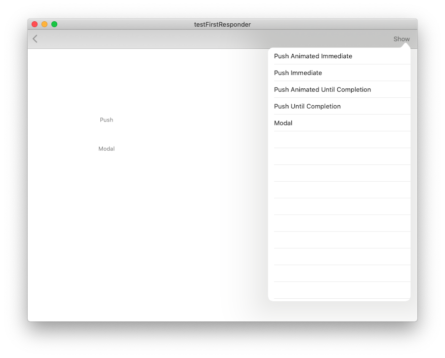

# testFirstResponder
---

This project demonstrated an unexpected behaviour on Catalyst that the first responder will be set to nil after dismissing Popovers, which was suppose to retain. This can be cross checked on iPad OS that doesn't happen.

Xcode 11.4
MacOS 10.15.3 
iPadOS 13.4
